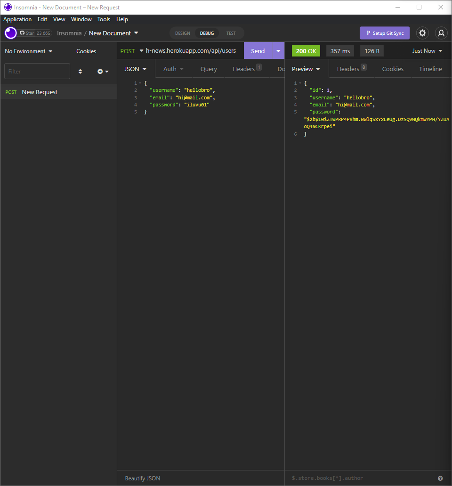
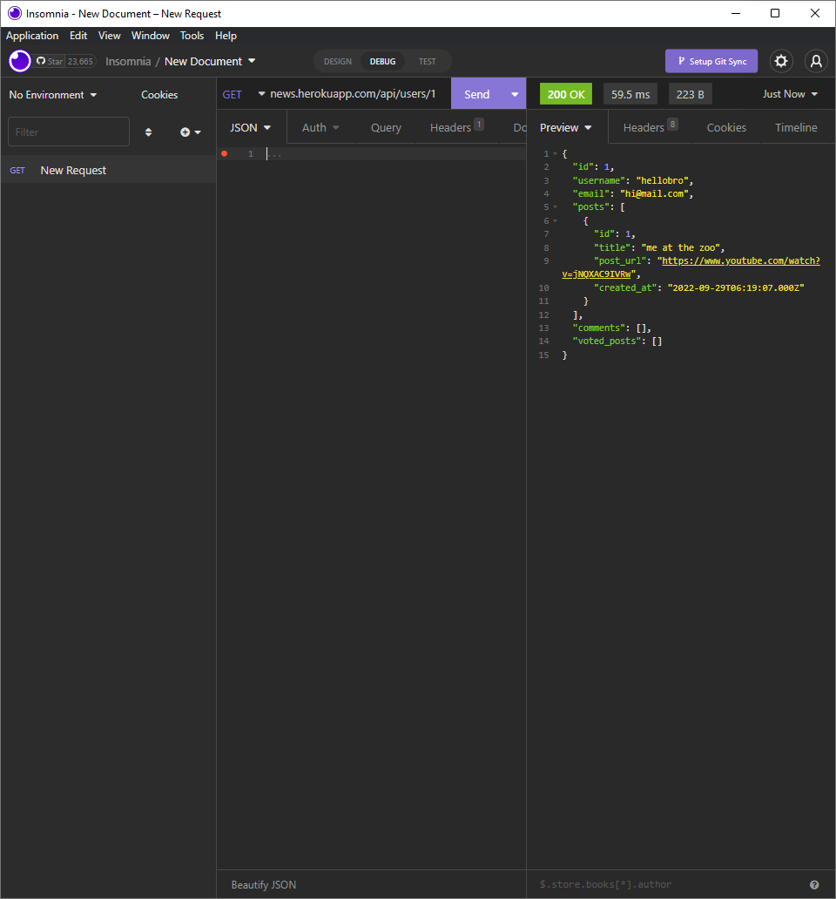

# Just Tech News API

  
## Description

A tech news website REST API where users can post, upvote, and comment on links to news articles.





## Table of Contents

- [Installation](#installation)
- [Usage](#usage)
- [License](#license)
- [Contributing](#contributing)
- [Tests](#tests)
- [Questions](#questions)

## Usage

Navigate to the [API](https://nifty-just-tech-news.herokuapp.com/api) and specify the desired data with the following endpoints: ```/api/users```, ```/api/posts```, and ```/api/comments```. CRUD operations may be performed on the API using your preferred API client.

## Installation

This application requires NodeJS installed to run. Clone this repository to your local machine and run ```npm i``` to install required dependencies, then run ```npm start``` to initialize the server/database. The API may then be accessed in localhost.

## License
    
Licensed under the [MIT License](https://spdx.org/licenses/MIT.html)

## Contributing

No contributions will be accepted at this time.

## Tests

No testing is planned for this project at this time.

## Questions

Have questions? Reach me at the following sources!

* GitHub: [realnifty](https://github.com/realnifty)
* E-mail: rogelioalbertopedraza@gmail.com or lovecore@pm.me